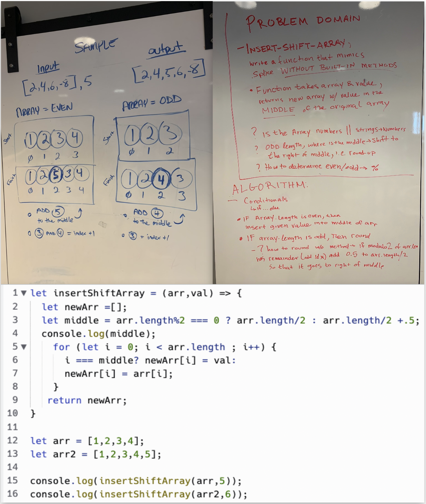

# Insert to Middle of an Array
We will be given a random array of numbers (could be and even or odd amount) and we must take a random number given to us and place it in the middle of the array. The array we are given will automatically be sorted for us, so the number were receiving can be anything, but this number does not have to be in order of the sort.

 

## Whiteboard Process

 

## Approach & Efficiency
The approach we took as a group was to define exactly what the problem domain was and determine how we would get the output. We needed to breakdown the JS built in operator shift(), basically creating that function ourselves. Once we had an idea on how we would write the code, we drew out how it would look if we had to visualize it outside of a text format.
